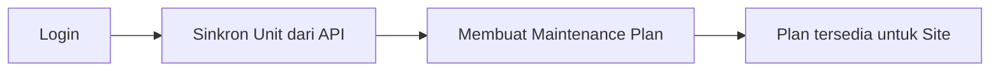
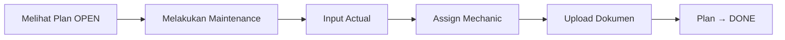

Purpose: Technical reference for ARKA MMS (Maintenance Monitoring System)
Last Updated: 2026-03-03

## Architecture Documentation Guidelines

### Document Purpose

This document describes the CURRENT WORKING STATE of the application architecture. It serves as:

- Technical reference for understanding how the system currently works
- Onboarding guide for new developers
- Design pattern documentation for consistent development
- Schema and data flow documentation reflecting actual implementation

### What TO Include

- **Current Technology Stack**: Technologies actually in use
- **Working Components**: Components that are implemented and functional
- **File and Function Descriptions**: Short descriptions of ALL the files and functions in the codebase
- **Actual Database Schema**: Tables, fields, and relationships as they exist
- **Implemented Data Flows**: How data actually moves through the system
- **Working API Endpoints**: Routes that are active and functional
- **Deployment Patterns**: How the system is actually deployed
- **Security Measures**: Security implementations that are active

### What NOT to Include

- **Issues or Bugs**: These belong in `MEMORY.md` with technical debt entries
- **Limitations or Problems**: Document what IS working, not what isn't
- **Future Plans**: Enhancement ideas belong in `backlog.md`
- **Deprecated Features**: Remove outdated information rather than marking as deprecated
- **Wishlist Items**: Planned features that aren't implemented yet

### Update Guidelines

- **Reflect Reality**: Always document the actual current state, not intended state
- **Schema Notes**: When database schema has unused fields, note them factually
- **Cross-Reference**: Link to other docs when appropriate, but don't duplicate content

### For AI Coding Agents

- **Investigate Before Updating**: Use codebase search to verify current implementation
- **Move Issues to Memory**: If you discover problems, document them in `MEMORY.md`
- **Factual Documentation**: Describe what exists, not what should exist

---

# ARKA MMS - Maintenance Monitoring System Architecture

> **Sumber desain lengkap**: `docs/maintenance-monitoring-system.md` — Referensi utama untuk domain, model data, business rules, dan alur proses.

## Project Overview

**ARKA MMS** adalah sistem monitoring maintenance fundamental unit alat berat pertambangan secara terpusat, terstruktur, dan dapat diaudit.

### Tujuan Sistem

- Perencanaan maintenance (HO)
- Pelaporan actual maintenance (Site)
- Monitoring compliance
- Penyimpanan dokumen maintenance
- Reporting bulanan dan tahunan

### Jenis Maintenance

Inspection, Washing, Greasing, Track Cleaning, PPU/CTS

## Technology Stack

### Frontend + Backend

- **Framework**: Next.js (App Router, Fullstack)

### Database

- **Database**: MySQL (Laragon), database `arka_mms`
- **ORM**: Prisma — schema di `prisma/schema.prisma`, terhubung via `DATABASE_URL` di `.env`
- **Status**: Schema diterapkan (`prisma db push`), seed `maintenance_types` (5 jenis) sudah dijalankan. Attachment dipodel polymorphic (`entity_type` + `entity_id`), tanpa relasi Prisma ke Plan/Actual; query di aplikasi pakai filter. Relasi Plan–Actual one-to-one: `maintenance_actuals.plan_id` @unique.

### Storage Dokumen

- **Storage**: MinIO (S3 compatible, on-prem friendly)

### Optional Infrastructure

- **Redis**: Cache / queue
- **Worker Node**: Cron job & scheduler
- **Deployment**: Docker Compose

### Production Deployment (Windows + XAMPP)

- **Target**: Server Windows, XAMPP (MySQL), IP internal (mis. 192.168.32.37).
- **Aplikasi**: Next.js dijalankan dengan `next start` (Node.js), bukan di dalam Apache. Apache (XAMPP) opsional sebagai reverse proxy.
- **Panduan lengkap**: `docs/deployment-production.md` — merujuk pada [Next.js Production Checklist](https://nextjs.org/docs/app/building-your-application/deploying/production-checklist) dan [Self-Hosting](https://nextjs.org/docs/app/guides/self-hosting).

## Role Pengguna

| Role           | Capability                                                                    |
| -------------- | ----------------------------------------------------------------------------- |
| **ADMIN_HO**   | Membuat maintenance plan, melihat seluruh report, akses global, **CRUD User** |
| **ADMIN_SITE** | Input maintenance actual, melihat plan site                                   |
| **MECHANIC**   | Input maintenance actual, ditugaskan sebagai pelaksana                        |

## Authentication & Access Control

- **Auth flow**: Login (`POST /api/auth/login`) → JWT (payload: `id`, `role`) → disimpan di `localStorage`/`sessionStorage` dan cookie `accessToken` (HttpOnly) untuk middleware.
- **Next.js Middleware** (`src/middleware.js`): Berjalan di Edge sebelum route; memverifikasi cookie `accessToken` dengan **jose**; route `/apps/*` dan `/dashboards/*` dilindungi; `/apps/user/*` hanya untuk role **ADMIN_HO**; tidak ada token/token invalid → redirect `/login`; token valid tapi role tidak sesuai → redirect `/401`. Proteksi berbasis **role** (bukan permission DB) karena middleware Edge tidak mengakses DB. Ref: [Next.js Middleware](https://nextjs.org/docs/advanced-features/middleware).
- **Role & Permission (Spatie-like)**:
  - **Tabel**: `permissions` (id, name e.g. `plan.create`, `user.manage`), `roles` (id, name: ADMIN_HO/ADMIN_SITE/MECHANIC), `role_permissions`, `user_roles`. User bisa punya banyak role lewat `user_roles`; saat ini disinkron dengan `users.role` (satu role per user).
  - **Lib** (`src/lib/permissions.js`): `getPermissionsForUser(userId)` — load permission names dari DB; `buildAbilityFromPermissions(permissions)` — build CASL Ability; `getAbilityForUser(userId, roleLegacy)` — untuk pengecekan server-side (API).
  - **Auth response**: `GET /api/auth/me` dan response login mengembalikan `userData.permissions` (array string) agar client bisa build ability tanpa request tambahan.
- **ACL (CASL)** (`src/configs/acl.js`): `buildAbilityFor(user, subject)` — jika `user.permissions` ada, build dari permissions (DB); else fallback rules berdasarkan `user.role`. Halaman dan menu di-filter oleh `AclGuard` dan `CanViewNavLink`; subject `user-list` hanya boleh `manage`/`read` oleh yang punya permission (ADMIN_HO).
- **API guard**: `GET/POST /api/users` dan `GET/PATCH/DELETE /api/users/[id]` memeriksa `Authorization: Bearer <token>` dan mengembalikan 403 jika `payload.role !== 'ADMIN_HO'`. Untuk pengecekan granular bisa pakai `getAbilityForUser(decoded.id, decoded.role)` lalu `ability.can('manage', 'user-list')`.
- **Logout**: `POST /api/auth/logout` menghapus cookie; client membersihkan storage dan redirect ke `/login`.

## Core Domain Models

Lihat `docs/maintenance-monitoring-system.md` §5 untuk ERD lengkap. Ringkasan:

- **units** — Cache dari API eksternal (id, code, model, project_id, project_name)
- **maintenance_types** — Inspection, Washing, Greasing, dll.
- **users** — username (unique), name, email (opsional), role (enum), project_scope; relasi `user_roles` → roles
- **permissions** — name (e.g. plan.create, user.manage); **roles** — name (ADMIN_HO, ADMIN_SITE, MECHANIC); **role_permissions**, **user_roles** — many-to-many
- **maintenance_plans** — unit_id, maintenance_type_id, planned_date, status (OPEN/DONE/MISSED)
- **maintenance_actuals** — plan_id (nullable), unit_id, maintenance_date, hour_meter
- **maintenance_actual_mechanics** — Assignment mechanic ke actual
- **attachments** — entity_type (MAINTENANCE_PLAN \| MAINTENANCE_ACTUAL), entity_id, storage_path
- **monthly_reports** / **yearly_reports** — (schema ada; fitur report dihapus dari aplikasi)

## Business Flow

### Flow HO



### Flow Site



### Scheduler

- Plan lewat tanggal tanpa actual → **MISSED**
- Sinkron unit dari API eksternal

## API Endpoints (Konseptual)

| Area        | Endpoints                                                                                                                                                            |
| ----------- | -------------------------------------------------------------------------------------------------------------------------------------------------------------------- |
| Maintenance | POST/GET `/api/maintenances`                                                                                                                                         |
| Plan        | POST/GET `/api/plans`                                                                                                                                                |
| Attachment  | POST/GET `/api/attachments`                                                                                                                                          |
| Unit        | GET `/api/units`, POST `/api/units/sync`                                                                                                                             |
| Dashboard   | GET `/api/dashboard/stats` (totalUnits, dueThisMonth, overdue, complianceRate); GET `/api/dashboard/achievement?year=` (program per site, PLAN/ACTUAL/ACH per bulan) |

## Dashboard (Implementasi)

- **Route**: `/dashboards/maintenance` — halaman utama setelah login (getHomeRoute → `/dashboards/maintenance`).
- **API**: `GET /api/dashboard/stats` — mengembalikan `totalUnits`, `dueThisMonth`, `overdue`, `complianceRate` (dan `meta`). Status plan (OPEN/DONE) diturunkan dari ada/tidaknya actual terhubung ke plan; overdue = plan OPEN dengan year/month sudah lewat.
- **API Achievement**: `GET /api/dashboard/achievement?year=YYYY` — data untuk tabel "Achievement Program Maintenance All Site": per site (projectId), per program CBM (maintenance type), per bulan PLAN/ACTUAL/ACH; site "All Program" dan "All Site Ach". Nilai ACH kosong/0 plan ditampilkan sebagai — (menghindari #DIV/0!).
- **Halaman**: `src/pages/dashboards/maintenance/index.js` — fetch stats + achievement, render 4 widget dan tabel achievement dengan pilih tahun.
- **Widget** (`src/views/dashboards/maintenance/`): Total Unit, Due This Month, Compliance Rate, Overdue (masing-masing pakai `CardStatsVertical`).
- **Tabel**: `AchievementTable.js` — kolom NO, PROGRAM CBM, SITE, REMAKS (PLAN/ACTUAL/ACH), Jan–Des, DES; baris per site + All Program (kuning), baris terakhir All Site Ach (kuning).
- **Nav**: Menu Dashboards → Maintenance (vertical & horizontal nav, server-side menu).
- Belum diimplementasi: Activity Log, grafik (Maintenance per type, Plan vs Actual trend, Hour meter trend).

## Business Rules (Ringkasan)

- Hour meter tidak boleh lebih kecil dari histori sebelumnya
- Actual yang sesuai plan → status plan menjadi DONE
- Maintenance status: OPEN, DONE, MISSED, UNPLANNED
- Attachment: optional, multi file, cascade delete

## Status Implementasi

Desain sistem lengkap. **Sistem siap memasuki tahap implementasi.** Lihat `docs/todo.md` untuk task implementasi.

---

## Quick Reference

### Key File Locations (Vuexy Next.js – Pages Router)

- **Template**: Vuexy Next.js Admin Template v1.2.0 (JavaScript, MUI, Pages Router).
- **Pages & API**: `src/pages/` (routing), `src/pages/api/` (API routes).
- **Core (jangan diubah)**: `src/@core/` — layouts, theme, components, hooks.
- **Menu (data)**: `src/navigation/vertical/index.js`, `src/navigation/horizontal/index.js`.
- **Custom layout/ACL**: `src/layouts/components/acl/getHomeRoute.js`.
- **Auth & RBAC**: `src/context/AuthContext.js`, `src/middleware.js` (Next.js middleware + jose), `src/pages/api/auth/login.js`, `me.js`, `logout.js`; `src/configs/acl.js` (CASL); API users cek role ADMIN_HO.
- **Views**: `src/views/` — komponen halaman (apps/user, unit, invoice, dll.).
- **Config**: `src/configs/` (themeConfig, acl, auth, APIs).
- **Prisma**: `prisma/schema.prisma`, client: `src/lib/prisma.js`.
- **Perbandingan dengan Vuexy terbaru**: `docs/vuexy-folder-structure-comparison.md`.

### UI / Layout (Vuexy MUI)

Dashboard menggunakan Vuexy (MUI, vertical/horizontal layout):

- **Layout**: `src/@core/layouts/` — VerticalLayout, HorizontalLayout, BlankLayout.
- **Sidebar/Nav**: Komponen di `@core/layouts/components/vertical` / `horizontal`.
- **Theme**: MUI + `@core/theme` (ThemeOptions, overrides, palette).
- **User dropdown**: `@core/layouts/components/shared-components/UserDropdown.js`.

### Common Commands

```bash
# Development
npm run dev

# Database (Prisma)
npm run db:generate   # generate Prisma Client
npm run db:push       # sync schema ke MySQL (tanpa migration file)
npm run db:migrate    # prisma migrate dev
npm run db:studio     # buka Prisma Studio
npm run db:seed       # seed maintenance_types

# Build
npm run build
```

### Environment Variables

```env
DATABASE_URL="mysql://root:@localhost:3306/arka_mms"
MINIO_ENDPOINT="..."
NEXT_PUBLIC_APP_URL="http://localhost:3000"
```

---

**Last Updated**: 2026-03-03
**Next Review**: When implementation begins or major architectural changes occur
